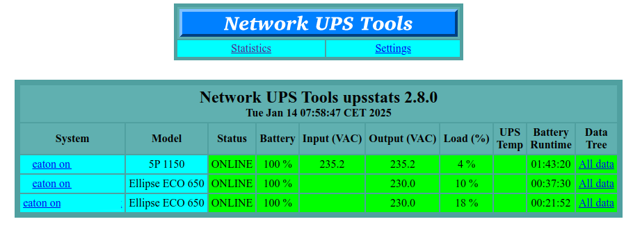

# docker-nut-stats
Just display stats from NUT's remote monitored UPS.

use [NUT](https://networkupstools.org/features.html) statistics cgi tool to display remote monitored UPS.

> [!NOTE]
> settings parameters and sending commands for nut are not defined in this project as I only monitor UPS with limited rights remote user. see [this page](https://blog.shadypixel.com/monitoring-a-ups-with-nut-on-debian-or-ubuntu-linux/) for settings nut daemon and monitoring on remote servers.

Available docker images architectures are: amd64 arm64 arm32v7

if using pihole on the same host, use pihole's network for name resolution or use ip instead of servers name. 

## usage  

### env vars:
* SERVER_NAME: nginx server name
* LOG_DEST: nginx access log /dev/null,/var/log/acces.log, /dev/stdout by default
* DEBUG: any value, activate bash debug et nginx-debug.

Up to 9 UPS may be monitored, defined in compose.xml.
each ups is defined by two values.

UPS<number>_NAME: "ups X's name"
UPS<number>_LOC: "ups@host"

nginx's access is restricted thanks to htpasswd, defined with HT_USER and HT_PWD. If no values are given, HT_USER=nutuser, HT_PWD=nutpassword.

## Screenshot

Github project: [docker-nut-stats](https://github.com/edgd1er/docker-nut-stats)

Docker hub: [nut-stats](https://hub.docker.com/r/edgd1er/nut-stats)